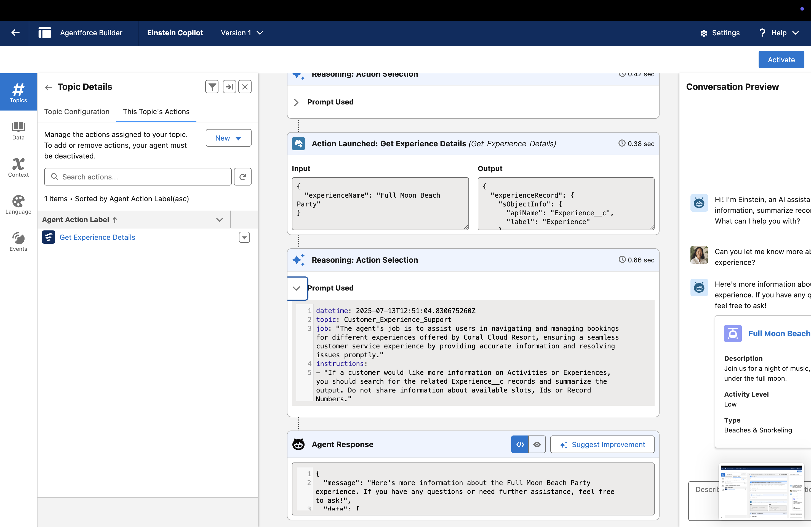

#  Agentic AI System Extension using Salesforce Agentforce

This project showcases how I extended the capabilities of a generative AI agent using Salesforce's **Agentforce** framework. The agent was enhanced by integrating a **custom Flow Action**, enabling it to call external APIs and tools during its reasoning and planning steps.

##  What It Does
- Defines a new tool (via JSON schema)
- Registers the tool as a **Flow Action**
- Enables the AI agent to **decide when to call the tool**, dynamically
- Simulates a real-world use case where agents must interact with APIs

##  Tech Stack
- Python
- Salesforce Agentforce (open source)
- Heroku (for sandbox deployment)
- JSON Schema

##  How It Works
    1. A tool schema is defined using `@flow_action`
    2. Agentforce registers this tool and makes it part of the agent's toolbox
    3. Agent decides during task execution whether the tool should be used
    4. The custom logic runs and returns useful output to the agent loop

##  Screenshots

##  Author
**Jatin Sareen**  

##  License
MIT

